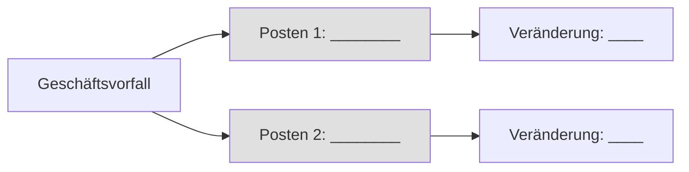
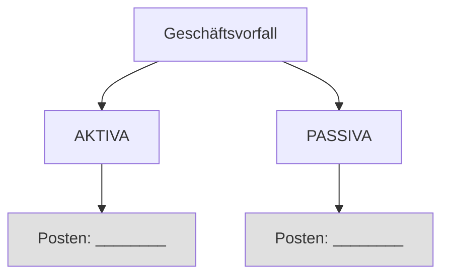
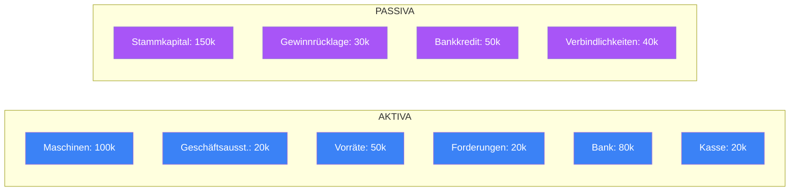
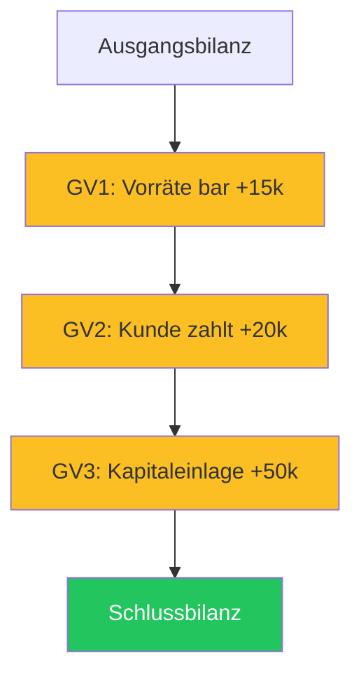
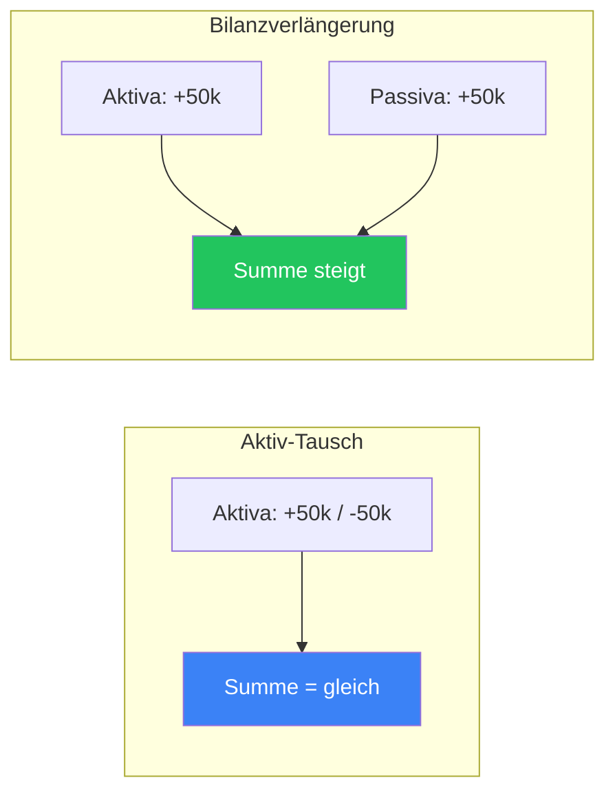

# Aufgabenblatt: Bilanzveränderungen

**Name:** __________________ **Datum:** __________________

> **Hinweis:** Nutze das interaktive Lernspiel, um die Geschäftsvorfälle zu visualisieren und zu verstehen!

---

## Aufgabe 1: Bilanzveränderungen erkennen (16 Punkte)

Bestimme für jeden Geschäftsvorfall die Art der Bilanzveränderung:

| Nr. | Geschäftsvorfall | AT | PT | BV | BK |
|-----|------------------|----|----|----|----|
| 1. | Kauf einer Maschine für 50.000 € bar | ☐ | ☐ | ☐ | ☐ |
| 2. | Kunde zahlt Rechnung über 20.000 € | ☐ | ☐ | ☐ | ☐ |
| 3. | Geldabhebung von Bank: 10.000 € auf Kasse | ☐ | ☐ | ☐ | ☐ |
| 4. | Jahresüberschuss 30.000 € in Gewinnrücklage | ☐ | ☐ | ☐ | ☐ |
| 5. | Wareneinkauf auf Rechnung: 40.000 € | ☐ | ☐ | ☐ | ☐ |
| 6. | Kredittilgung bar: 30.000 € | ☐ | ☐ | ☐ | ☐ |
| 7. | Lieferantenverb. durch Bankkredit ablösen: 25.000 € | ☐ | ☐ | ☐ | ☐ |
| 8. | Gesellschafter zahlt Stammkapital ein: 50.000 € | ☐ | ☐ | ☐ | ☐ |
| 9. | Lieferantenrechnung bar bezahlen: 25.000 € | ☐ | ☐ | ☐ | ☐ |
| 10. | Bankkredit umschulden: 15.000 € | ☐ | ☐ | ☐ | ☐ |
| 11. | Maschinenkauf mit Kredit: 60.000 € | ☐ | ☐ | ☐ | ☐ |
| 12. | Privatentnahme: 10.000 € | ☐ | ☐ | ☐ | ☐ |
| 13. | Kauf von Vorräten bar: 15.000 € | ☐ | ☐ | ☐ | ☐ |
| 14. | Rücklage in Stammkapital: 10.000 € | ☐ | ☐ | ☐ | ☐ |
| 15. | Kauf Geschäftsausstattung auf Kredit: 20.000 € | ☐ | ☐ | ☐ | ☐ |
| 16. | Vorräte verkaufen und Kredit tilgen: 15.000 € | ☐ | ☐ | ☐ | ☐ |

*Legende: AT = Aktiv-Tausch, PT = Passiv-Tausch, BV = Bilanzverlängerung, BK = Bilanzverkürzung*

---

## Aufgabe 2: Bilanzposten zuordnen (8 Punkte)

Ordne die Geschäftsvorfälle den betroffenen Bilanzposten zu und gib an, ob diese steigen (+) oder sinken (-):

### a) Maschinenkauf für 50.000 € in bar

**Betroffene Posten (Aktiva):**
1. _________________ Veränderung: _______
2. _________________ Veränderung: _______

---

### b) Wareneinkauf auf Rechnung: 40.000 €

**Betroffene Posten:**
1. _________________ (A/P) Veränderung: _______
2. _________________ (A/P) Veränderung: _______

---

### c) Kredittilgung bar: 30.000 €

**Betroffene Posten:**
1. _________________ (A/P) Veränderung: _______
2. _________________ (A/P) Veränderung: _______

---

### d) Jahresüberschuss 30.000 € in Gewinnrücklage einstellen

**Betroffene Posten (Passiva):**
1. _________________ Veränderung: _______
2. _________________ Veränderung: _______

---

## Aufgabe 3: Bilanzsumme berechnen (6 Punkte)

Gegeben ist folgende Ausgangsbilanz:

| AKTIVA | Betrag | PASSIVA | Betrag |
|--------|--------|---------|--------|
| Maschinen | 100.000 € | Stammkapital | 150.000 € |
| Geschäftsausstattung | 20.000 € | Gewinnrücklage | 30.000 € |
| Vorräte | 50.000 € | Bankkredit | 50.000 € |
| Forderungen | 20.000 € | Verbindlichkeiten | 40.000 € |
| Bankguthaben | 80.000 € | | |
| Kasse | 20.000 € | | |
| **Summe** | **290.000 €** | **Summe** | **270.000 €** |

Berechne die neue Bilanzsumme nach folgenden Geschäftsvorfällen:

### a) Maschinenkauf für 50.000 € in bar

Art der Bilanzveränderung: _______________________

Neue Bilanzsumme: _______________________

---

### b) Wareneinkauf auf Rechnung: 40.000 €

Art der Bilanzveränderung: _______________________

Neue Bilanzsumme: _______________________

---

### c) Kredittilgung bar: 30.000 €

Art der Bilanzveränderung: _______________________

Neue Bilanzsumme: _______________________

---

## Aufgabe 4: Bilanz nach Geschäftsvorfällen (10 Punkte)

Erstelle die Schlussbilanz nach folgenden Geschäftsvorfällen (nutze die Ausgangsbilanz aus Aufgabe 3):

1. Kauf von Vorräten bar: 15.000 €
2. Kunde zahlt Rechnung: 20.000 €
3. Gesellschafter zahlt Stammkapital ein: 50.000 €

**Schlussbilanz:**

| AKTIVA | Betrag | PASSIVA | Betrag |
|--------|--------|---------|--------|
| Maschinen | _________ | Stammkapital | _________ |
| Geschäftsausstattung | _________ | Gewinnrücklage | _________ |
| Vorräte | _________ | Bankkredit | _________ |
| Forderungen | _________ | Verbindlichkeiten | _________ |
| Bankguthaben | _________ | | |
| Kasse | _________ | | |
| **Summe** | _________ | **Summe** | _________ |

---

## Aufgabe 5: Transferaufgabe (10 Punkte)

Erkläre in eigenen Worten, warum bei einem **Aktiv-Tausch** die Bilanzsumme gleich bleibt, während sie bei einer **Bilanzverlängerung** steigt.

**Deine Erklärung:**

_______________________________________________________________________________

_______________________________________________________________________________

_______________________________________________________________________________

_______________________________________________________________________________

_______________________________________________________________________________

---

## Bewertung

**Punkte:** _____ / 50  
**Note:** _______

---

## Lösungshinweise (für Lehrer)

Aufgabe 1 - Lösungen anzeigen

1. AT | 2. AT | 3. AT | 4. PT | 5. BV | 6. BK | 7. PT | 8. BV | 9. BK | 10. PT | 11. BV | 12. BK | 13. AT | 14. PT | 15. BV | 16. BK

Aufgabe 3 - Lösungen anzeigen

a) Aktiv-Tausch, 290.000 €  
b) Bilanzverlängerung, 330.000 €  
c) Bilanzverkürzung, 260.000 €

