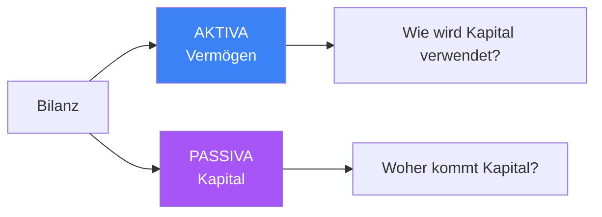
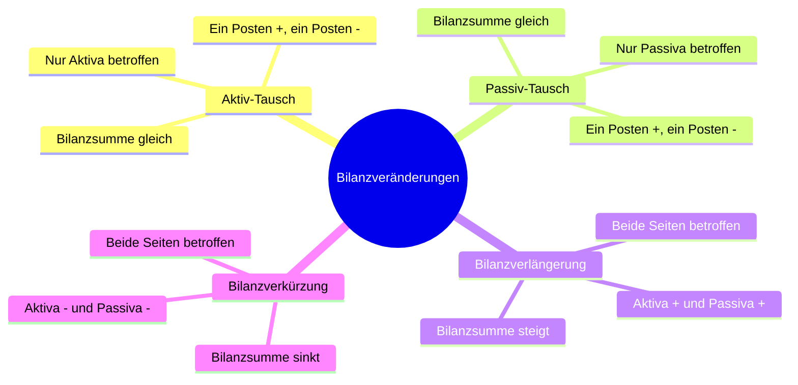
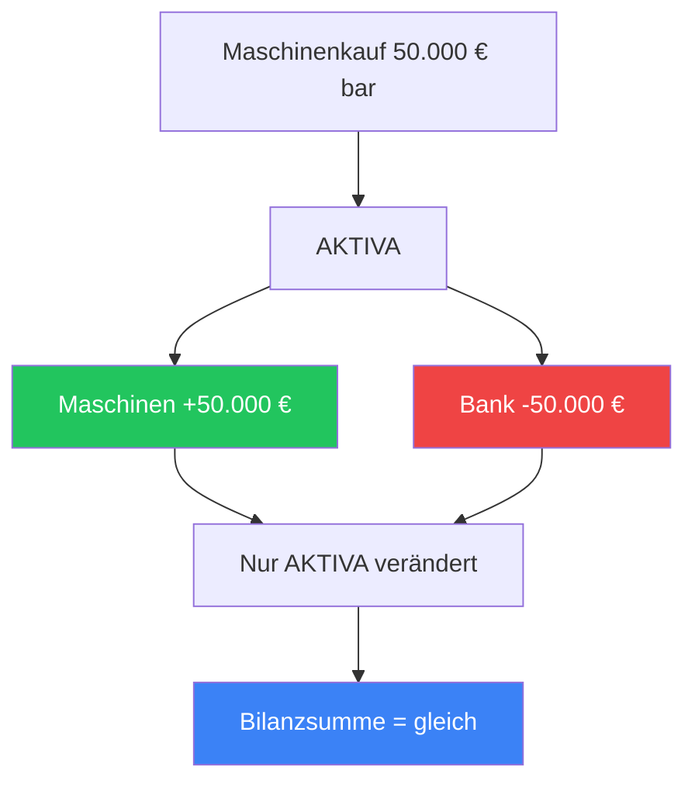
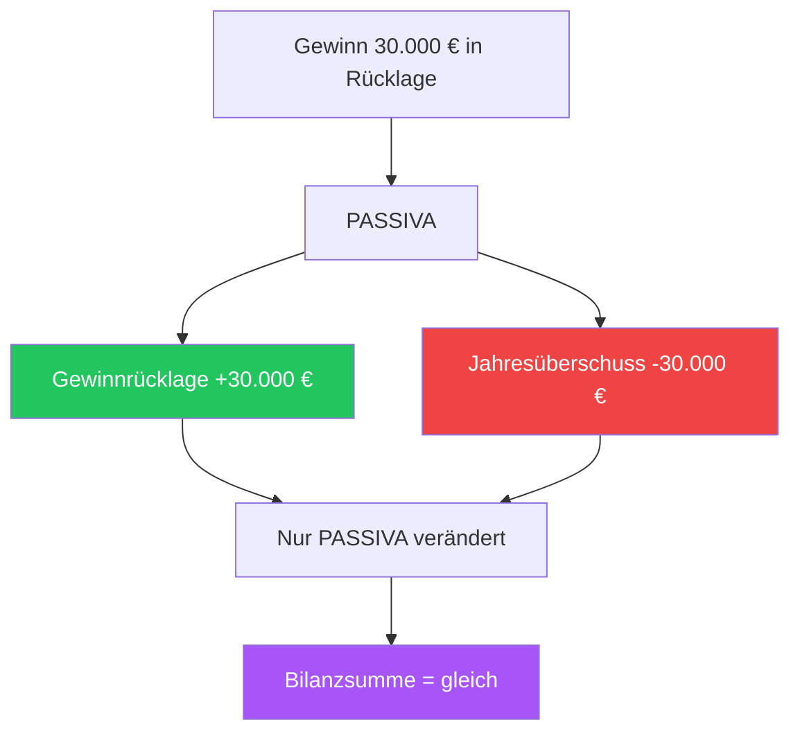
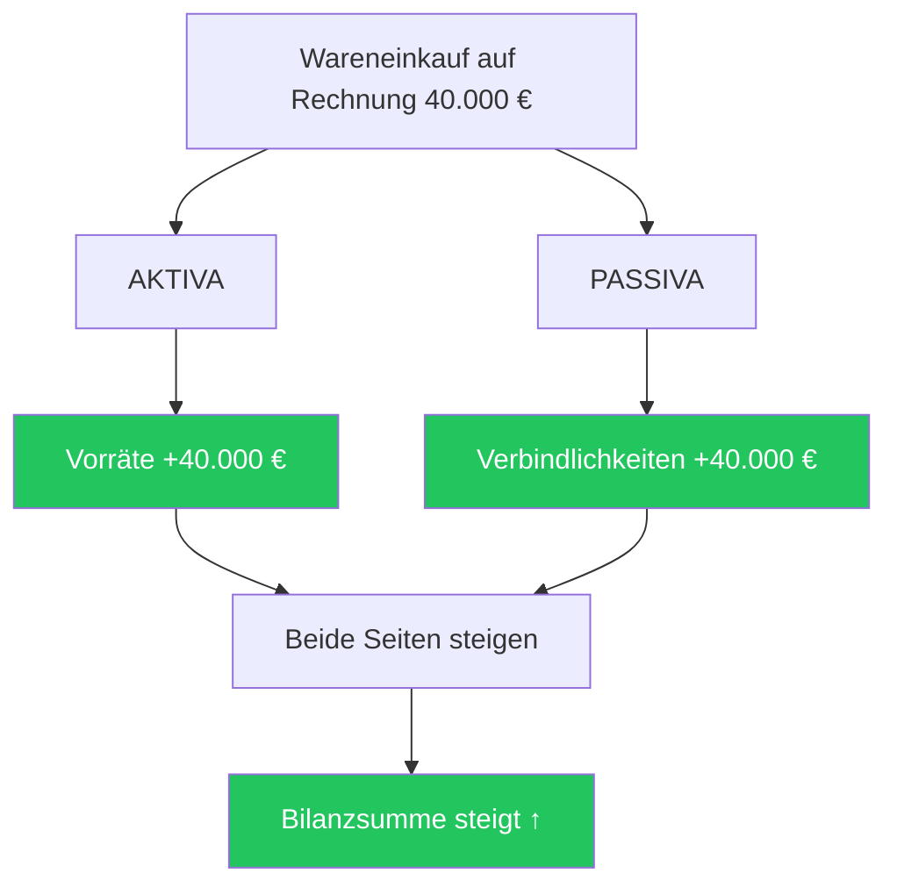
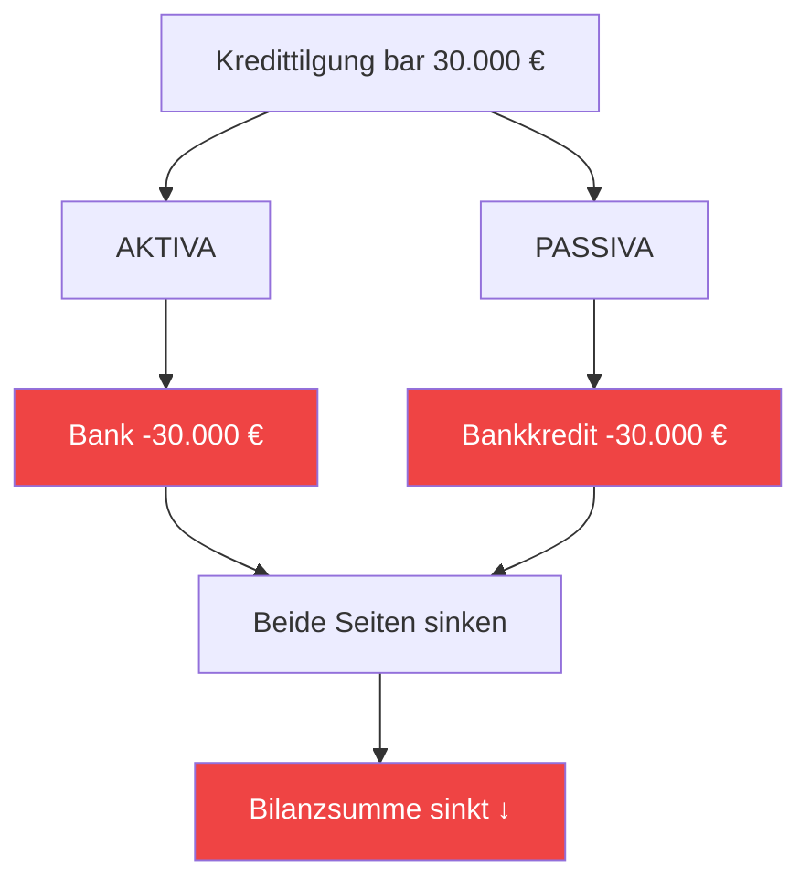
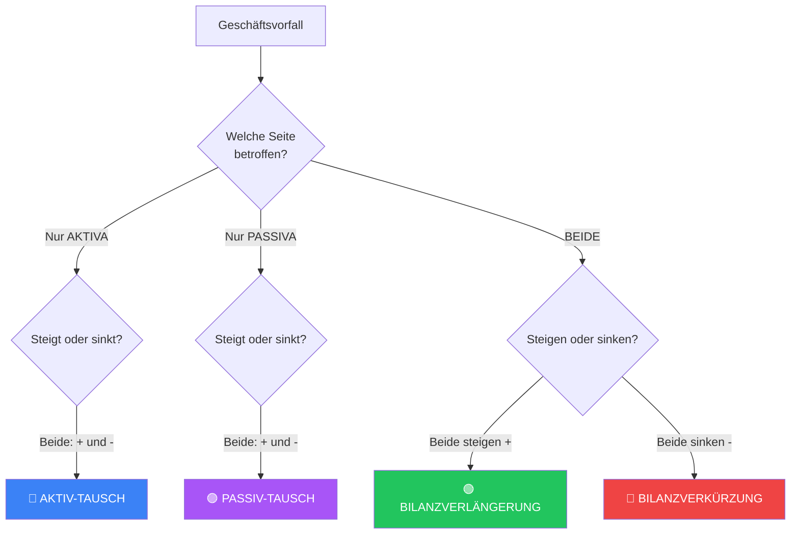
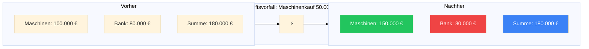

# Bilanzveränderungen - Infoblatt

## Was ist eine Bilanzveränderung?

Jeder Geschäftsvorfall in einem Unternehmen verändert die Bilanz. Die Bilanz besteht aus zwei Seiten:

- **AKTIVA** (linke Seite): Zeigt, *wie* das Kapital im Unternehmen verwendet wird (Vermögen)
- **PASSIVA** (rechte Seite): Zeigt, *woher* das Kapital stammt (Kapitalquellen)

**Grundregel:** Aktiva = Passiva (Die Bilanz ist immer ausgeglichen!)

---

## Die 4 Arten von Bilanzveränderungen

---

### 1. 🔵 Aktiv-Tausch

**Definition:** Nur die Aktiv-Seite verändert sich  
**Effekt:** Ein Aktivposten steigt (+), ein anderer sinkt (-)  
**Bilanzsumme:** Bleibt gleich

#### Beispiele:
- Maschinenkauf bar (50.000 €): ✅ +Maschinen, ❌ -Bank
- Kunde zahlt Rechnung (20.000 €): ✅ +Bank, ❌ -Forderungen
- Geld von Bank abheben (10.000 €): ✅ +Kasse, ❌ -Bank

**Merkregel:** *„Tausch auf der Haben-Seite"* – nur Vermögenswerte tauschen sich aus

---

### 2. 🟣 Passiv-Tausch

**Definition:** Nur die Passiv-Seite verändert sich  
**Effekt:** Ein Passivposten steigt (+), ein anderer sinkt (-)  
**Bilanzsumme:** Bleibt gleich

#### Beispiele:
- Gewinn in Rücklage einstellen (30.000 €): ✅ +Gewinnrücklage, ❌ -Jahresüberschuss
- Kredit umschulden (25.000 €): ✅ +Bankkredit, ❌ -Verbindlichkeiten
- Rücklage auflösen (10.000 €): ✅ +Stammkapital, ❌ -Gewinnrücklage

**Merkregel:** *„Tausch auf der Soll-Seite"* – nur Kapitalquellen tauschen sich aus

---

### 3. 🟢 Bilanzverlängerung (Aktiv-Passiv-Mehrung)

**Definition:** Beide Seiten steigen  
**Effekt:** Aktiva steigt (+) UND Passiva steigt (+)  
**Bilanzsumme:** Steigt

#### Beispiele:
- Wareneinkauf auf Rechnung (40.000 €): ✅ +Vorräte (A), ✅ +Verbindlichkeiten (P)
- Maschinenkauf mit Kredit (60.000 €): ✅ +Maschinen (A), ✅ +Bankkredit (P)
- Kapitaleinlage (50.000 €): ✅ +Bank (A), ✅ +Stammkapital (P)

**Merkregel:** *„Bilanz wird länger"* – beide Seiten wachsen

---

### 4. 🔴 Bilanzverkürzung (Aktiv-Passiv-Minderung)

**Definition:** Beide Seiten sinken  
**Effekt:** Aktiva sinkt (-) UND Passiva sinkt (-)  
**Bilanzsumme:** Sinkt

#### Beispiele:
- Kredittilgung bar (30.000 €): ❌ -Bank (A), ❌ -Bankkredit (P)
- Rechnung bar bezahlen (25.000 €): ❌ -Kasse (A), ❌ -Verbindlichkeiten (P)
- Privatentnahme (10.000 €): ❌ -Kasse (A), ❌ -Eigenkapital (P)

**Merkregel:** *„Bilanz wird kürzer"* – beide Seiten schrumpfen

---

## Übersicht: Die 4 Typen auf einen Blick

| Typ | Aktiva | Passiva | Bilanzsumme |
|-----|--------|---------|-------------|
| **Aktiv-Tausch** | ✅ + ❌ - | --- | = |
| **Passiv-Tausch** | --- | ✅ + ❌ - | = |
| **Bilanzverlängerung** | ✅ + | ✅ + | ↑ |
| **Bilanzverkürzung** | ❌ - | ❌ - | ↓ |

---

## Entscheidungsbaum: Welcher Typ?

---

## Wichtige Hinweise

- **Doppelte Buchführung:** Jeder Geschäftsvorfall berührt **mindestens 2 Bilanzposten**
- **Bilanzgleichung:** Aktiva = Passiva gilt **immer** (auch nach Veränderungen!)
- **Keine Mischformen:** Jeder Geschäftsvorfall gehört zu genau einem der 4 Typen
- **Reihenfolge in der Bilanz (§ 266 HGB):**
  - **Aktiva:** Nach *Liquidität* (von schwer zu leicht liquidierbar)
  - **Passiva:** Nach *Fälligkeit* (von langfristig zu kurzfristig)

---

## Praxis-Tipp

Um den Typ einer Bilanzveränderung zu bestimmen, frage dich:

1. Welche Bilanzseite(n) sind betroffen? (Aktiva, Passiva, beide?)
2. Steigen oder sinken die Posten? (+/-)
3. Verändert sich die Bilanzsumme?

**Beispiel:** „Wir kaufen eine Maschine für 50.000 € und bezahlen bar"

- ✓ Betroffen: Maschinen (A) und Kasse (A) → nur Aktiva
- ✓ Maschinen steigen (+50.000 €), Kasse sinkt (-50.000 €)
- ✓ Bilanzsumme bleibt gleich
- **→ 🔵 Aktiv-Tausch!**

---

## Visualisierung: Vorher/Nachher

---

**Nutze das interaktive Lernspiel, um die Geschäftsvorfälle animiert zu sehen! 🎮**
