# Visualisierungen: Bilanzveränderungen

Interaktive Mermaid-Diagramme zur Veranschaulichung der 4 Arten von Bilanzveränderungen.

---

## 1. Übersicht: Die 4 Typen im Vergleich

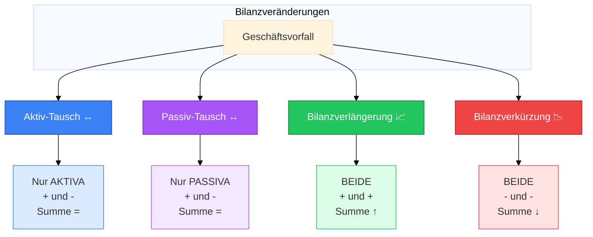

---

## 2. Aktiv-Tausch: Maschinenkauf bar (50.000 €)

### Vorher → Nachher

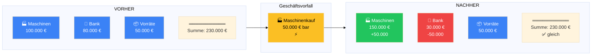

### Detaillierte Veränderung

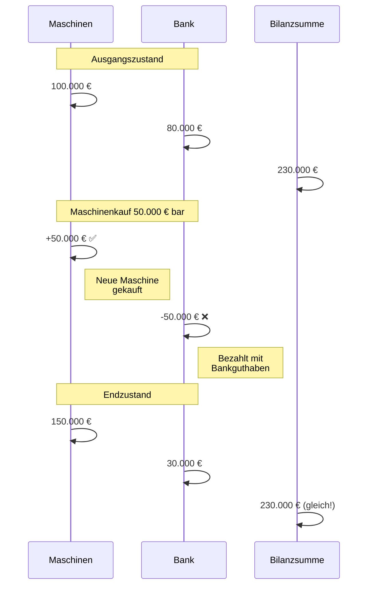

---

## 3. Passiv-Tausch: Gewinn in Rücklage (30.000 €)

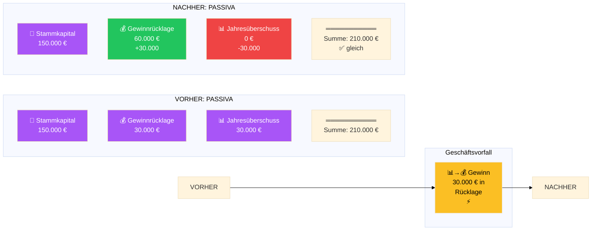

---

## 4. Bilanzverlängerung: Wareneinkauf auf Rechnung (40.000 €)

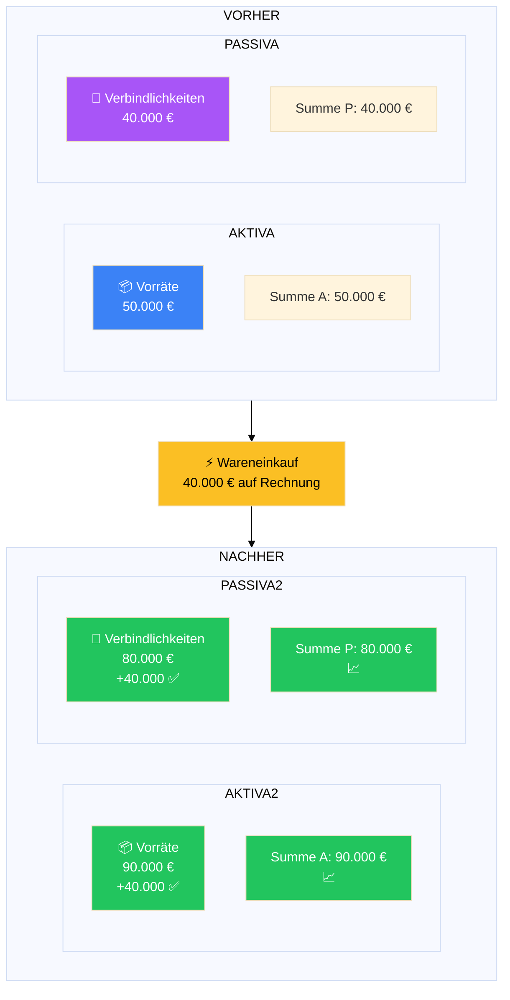

### Bilanz wächst auf beiden Seiten

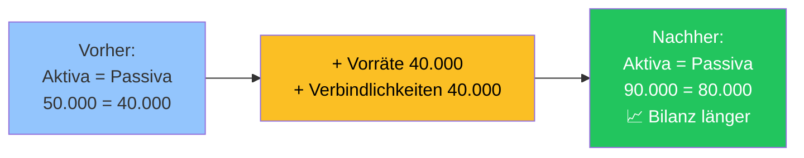

---

## 5. Bilanzverkürzung: Kredittilgung bar (30.000 €)

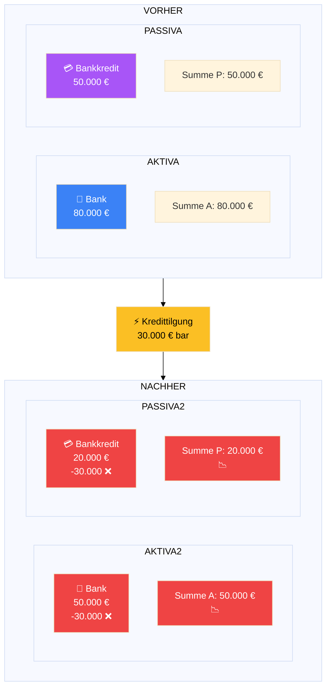

### Bilanz schrumpft auf beiden Seiten

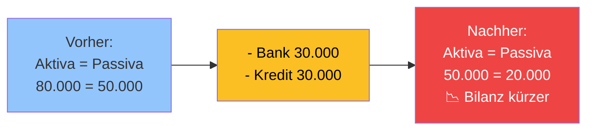

---

## 6. Entscheidungsbaum: Typ bestimmen

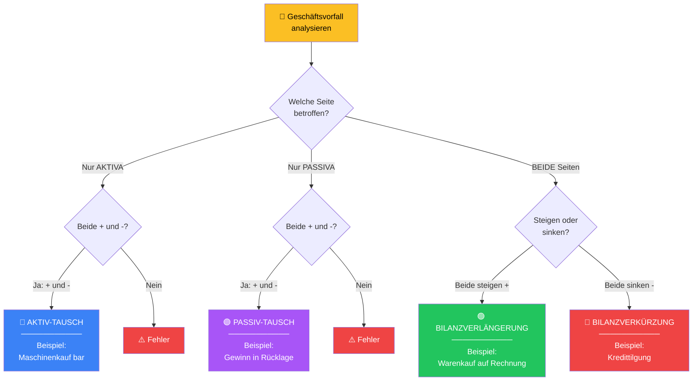

---

## 7. Timeline: Mehrere Geschäftsvorfälle hintereinander

```mermaid
gantt
    title Bilanzveränderungen im Zeitverlauf
    dateFormat X
    axisFormat %s
    
    section Bilanzsumme
    Start 250.000 € :milestone, 0, 0
    
    section Geschäftsvorfälle
    AT: Maschinenkauf 50k bar :done, 1, 2
    BV: Warenkauf 40k Rechnung :active, 3, 4
    BK: Kredittilgung 30k bar :crit, 5, 6
    PT: Gewinn in Rücklage :done, 7, 8
    
    section Bilanzsumme
    250.000 € (AT) :milestone, 2, 2
    290.000 € (BV) :milestone, 4, 4
    260.000 € (BK) :milestone, 6, 6
    260.000 € (PT) :milestone, 8, 8
```

---

## 8. Kompakte Übersicht: 4x4 Matrix

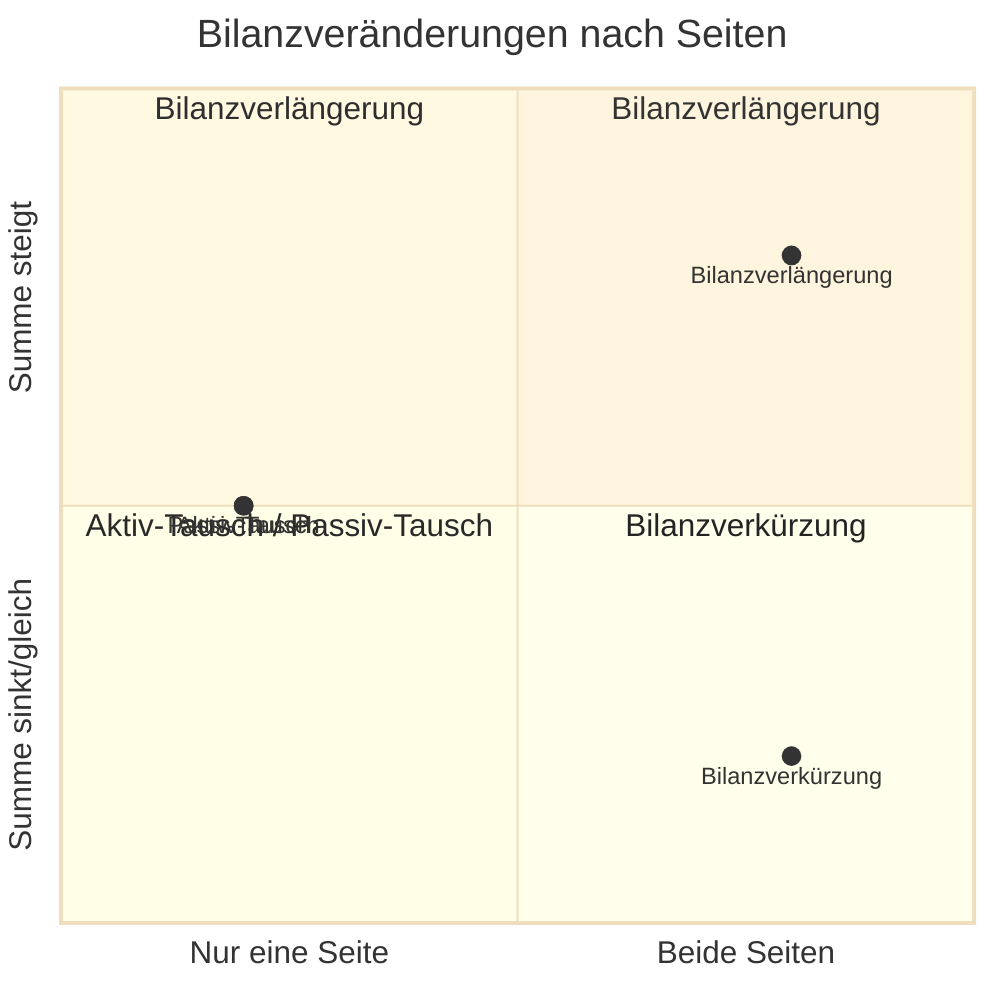

---

**Diese Diagramme können in Markdown-Viewern mit Mermaid-Support (GitHub, GitLab, VS Code, etc.) interaktiv dargestellt werden! 🎨**
